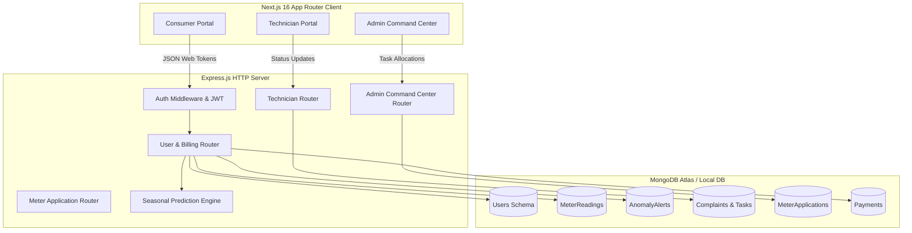

# ⚡ VoltGuard: Modern Smart Grid & Real-Time Electricity Anomaly Detection System

[](https://nextjs.org/)
[](https://expressjs.com/)
[](https://www.mongodb.com/)
[](https://tailwindcss.com/)
[](https://www.framer.com/motion/)

VoltGuard is a high-fidelity, full-stack utility command system and smart grid anomaly detection platform. Designed to safeguard national grid infrastructures, it utilizes statistical AI forecasting to analyze live telemetry from smart meters, detect power leakage or bypasses (tampering/theft), and automate reactive technician field dispatches.

---

## 🌟 Core System Portals

VoltGuard provides tailor-made, role-based workflows for three primary users:

### 👤 1. Consumer / Resident Dashboard
* **Preemptive Surge Reporting**: Consumers can submit scheduling logs (e.g., home events, parties, new heavy appliances, construction) to temporarily whitelist consumption spikes, preventing automated technician dispatches.
* **Neighborhood Benchmark Analytics**: Compares individual real-time consumption against the standard non-anomalous average of similar households in the same postal code/area.
* **Dynamic Analytics Visualization**: Implements premium composed charting that displays live telemetry curves plotted alongside an adaptive seasonal AI baseline.
* **Instant Payments Checkout**: Transparent billing breakdown ($0.15/kWh flat-rate + $10 base connection fee) and online settlement with dynamic transaction ID generation.

### 👷 2. Inspector / Technician Portal
* **Automated Proximity Dispatch**: When unwhitelisted consumption drops (< 40% of baseline) or jumps (> 150%) are flagged, field engineers registered in that neighborhood are instantly auto-allocated a reactive ticket.
* **Field Task Tracker**: Clean checklists and telemetry diagnostics to allow technicians to report status updates (Pending ➡️ Assigned ➡️ In Progress ➡️ Resolved) with custom resolution logs.

### 👑 3. Admin Command Center
* **Live Grid Intelligence**: Central command interface listing all registered consumers, active grid alerts, meter readings, billing logs, and support complaints.
* **Smart Meter Management**: Interface to review, approve, or reject new residential, commercial, or industrial smart meter installation applications.
* **Operational Dispatcher**: Seamless technician provisioning and manual override controls to reassign service tickets as required.

---

## 🏗️ System Architecture



---

## 🛠️ Technical Stack

| Component | Technology | Rationale |
| :--- | :--- | :--- |
| **Frontend Framework** | `Next.js 16 (App Router)` | Modern server-side rendering and static optimization. |
| **Styling Engine** | `Tailwind CSS v4.0` | Next-generation performance and styling. |
| **Animations** | `Framer Motion` & `GSAP` | Smooth interactive micro-animations and physics-based transitions. |
| **3D Rendering** | `Three.js` & `React Three Fiber` | Premium spatial telemetry overlays. |
| **Charts** | `Recharts` | High-fidelity interactive composed charts. |
| **Backend Framework** | `Express.js` | Fast, unopinionated minimalist routing. |
| **ORM / Database** | `Mongoose` & `MongoDB` | Schema-based document modeling for flexible timeseries-like data. |
| **Security** | `JWT` & `BcryptJS` | Standard-compliant cryptographically signed token-based auth. |

---

## 🚦 Smart AI Anomaly Engine Logic

VoltGuard evaluates telemetry using a dynamic baseline forecasting algorithm:

1. **Baseline Creation**: The engine queries the consumer's last **10 non-anomalous** meter readings.
2. **Seasonal Calibration**: Multipliers are applied to account for regional temperature fluctuations:
   * ☀️ **Summer**: `1.4x`
   * ❄️ **Winter**: `1.2x`
   * 🌧️ **Monsoon / Spring / Autumn**: `1.0x`
3. **Surge Thresholds**:
   * **High Surge** (`units > predicted * 1.5`): If unwhitelisted (no active *Usage Note*), triggers a high-consumption alert (possible power leak/grid overload) and dispatches a technician.
   * **Critical Low Drop** (`units < predicted * 0.4`): Automatically flags illegal bypass, physical tampering, or billing theft, generating a high-priority technician inspection ticket.

---

## 📂 Project Structure

```bash
electricitydbms/
├── controllers/              # Backend Express Controllers
│   ├── adminController.js
│   ├── authController.js
│   ├── meterApplicationController.js
│   └── userController.js
├── middleware/               # Auth Token Verification & Role Verification
│   └── auth.js
├── models/                   # Mongoose DB Schemas
│   ├── AnomalyAlert.js
│   ├── Complaint.js
│   ├── MeterApplication.js
│   ├── MeterReading.js
│   ├── Payment.js
│   ├── Technician.js
│   ├── UsageNote.js
│   └── User.js
├── routes/                   # REST API Routers
│   ├── admin.js
│   ├── auth.js
│   ├── meterApplicationRoutes.js
│   ├── technician.js
│   └── user.js
├── frontend/                 # Next.js 16 Client Portal
│   ├── src/
│   │   └── app/              # Page Routing
│   │       ├── admin-dashboard/
│   │       ├── technician-dashboard/
│   │       ├── dashboard/    # Consumer Portal
│   │       ├── complaints/
│   │       ├── payment/
│   │       ├── register/
│   │       ├── login/
│   │       └── contact/
│   ├── package.json
│   └── tailwind.config.ts
├── server.js                 # Express Application Entrypoint
├── check_users.js            # Diagnostics Database Seeder
├── package.json              # Backend Dependencies
└── .env                      # Configuration Environment Variables
```

---

## 🚀 Setup & Local Installation

### 📋 Prerequisites
* Node.js (v18.x or newer recommended)
* MongoDB (installed locally or a remote MongoDB Atlas URI)

### 1️⃣ Clone and Configure Variables
Set up a `.env` file in the root directory:

```env
PORT=3000
MONGODB_URI=mongodb://localhost:27017/electricitydb
JWT_SECRET=your_super_secure_jwt_token_secret_string
```

### 2️⃣ Run the Backend Server
```bash
# From the root directory
npm install
node server.js
```
*The server will boot and connect to MongoDB on port `3000`.*

### 3️⃣ Run Database Diagnostics (Optional)
Run the check utility to quickly view or verify seeded mock users in the database:
```bash
node check_users.js
```

### 4️⃣ Launch the Frontend Client
```bash
# Navigate to the frontend directory
cd frontend
npm install
npm run dev
```
*The React portal will start on [http://localhost:3001](http://localhost:3001).*

---

## 🔌 Core API Endpoints Reference

### 🔐 Authentication
* `POST /api/auth/register` - Create user or administrator.
* `POST /api/auth/login` - Authenticate user and sign JWT credentials.

### 👤 Consumer APIs
* `GET /api/user/dashboard` - Get full telemetry graph dataset, alerts, and bills.
* `POST /api/user/reading` - Push smart meter units telemetry (automatically evaluates anomalies).
* `GET /api/user/prediction` - Retrieve current seasonal expected usage forecast.
* `POST /api/user/usage-note` - Preemptively schedule upcoming load surges.
* `POST /api/user/pay-bill` - Settle outstanding connection dues.

### 👷 Technician APIs
* `GET /api/technician/tasks` - Get grid tickets assigned to the logged-in field operative.
* `POST /api/technician/update-status` - Update complaint states (e.g. from *Assigned* to *Resolved*).

### 👑 Admin APIs
* `GET /api/admin/dashboard` - Command center key metrics aggregates.
* `GET /api/admin/anomalies` - Review all current system anomaly flags.
* `POST /api/admin/technician` - Register new technician crews.
* `POST /api/admin/assign-complaint` - Re-route specific grid maintenance jobs.

---

## 📝 License
This project is licensed under the [ISC License](LICENSE). Built for academic DBMS design modules and experimental smart grid telemetry projects.
